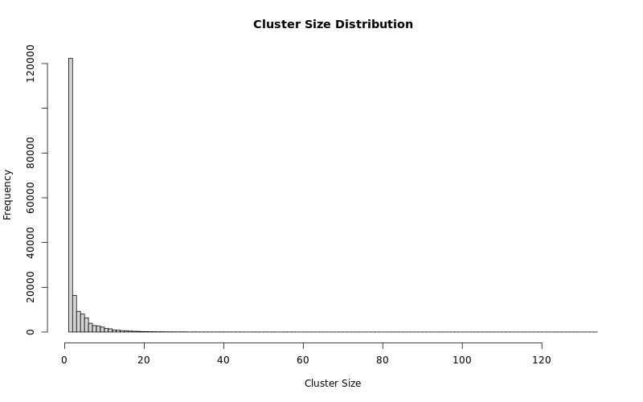
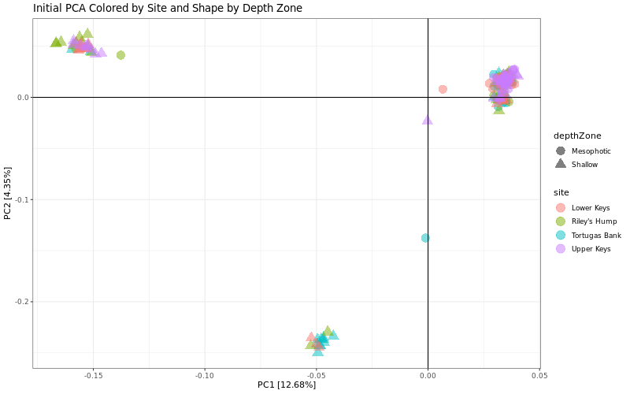
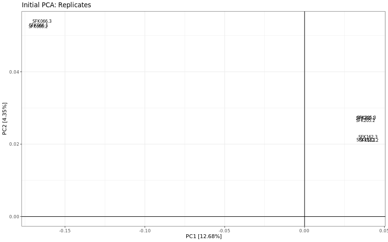
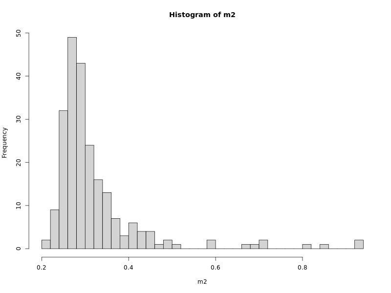

# Code notebook
Kirsten Carlson
<br>
<br>Coding notebook for recording code used, troubleshooting steps, brainstorming, etc.
<br>
<details>
  <summary>Date:     </summary>
Goal:
</details>

<details>
  <summary>Date:3/20/2026 </summary>
Goal: Look at cluster size distribution on discoSnp_Rad unfiltered clustered VCF

Code used:
```bash
cluster.sizes <- read.table("/scratch/kcarls36/projects/data/alignments/sint_align/discosnp/k25_D5/preprocessing_cluster_sizes.txt", header=FALSE, sep = "")
cluster.sizes <- as.numeric(cluster.sizes$V1)
summary(cluster.sizes)
 Min. 1st Qu.  Median    Mean 3rd Qu.    Max. 

  1.000   1.000   2.000   3.077   3.000 134.000 
```
```bash
hist(cluster.sizes, 
     breaks= seq(min(cluster.sizes), max(cluster.sizes), by = 1), 
     main="Cluster Size Distribution", 
     xlab="Cluster Size"
     )
```

</details>

<details>
  <summary>Date: 3/20/2026</summary>
Goal: Initial PCA of samples in R (from MarineGenomics SeqArray workflow)

Code used:
```bash
Bad samples: (excluding anything over 50%)
"SFK120"   "0.933740061308554"
"SFK085"   "0.920167161605518"
"SFK134"   "0.850491546125108"
"SFK188"   "0.809967429830444"
"SFK178"   "0.719001460867899"
"SFK198"   "0.714451216591628"
"SFK106"   "0.690801920682058"
"SFK127"   "0.670496455599195"
"SFK208"   "0.592127478685698"
"SFK214"   "0.582057069642686"
"SFK213"   "0.512573043394961"
```
```bash
# exclude samples with over 50% missing data
# Removed 4% of samples
bad_samples = c("SKF120", "SFK085", "SFK134", "SFK188", "SFK178", "SFK198", "SFK106", "SKF127", "SFK208", "SFK214", "SFK213")

sample.ids = seqGetData(gdsin, "sample.id")
keep = sample.ids[which(!sample.ids %in% bad_samples)]

# This process took about 45 min with 1 thread..
snpset <- SNPRelate::snpgdsLDpruning(gdsin, ld.threshold=0.2, autosome.only=F, start.pos="random", num.thread=1, remove.monosnp=T, sample.id=keep)
snpset.id <- unlist(unname(snpset))

# 334048 variants
# Excluding 308,769 SNVs
# Number samples: 217
# # SNVs: 25,279
# sliding window: 500,000 basepairs, Inf SNPs

# PCA with maf > 5%
pca.out = SNPRelate::snpgdsPCA(autosome.only=F, gdsin, num.thread=2, remove.monosnp=T, maf=0.05, snp.id=snpset.id, sample.id=keep)


# Calculating allele counts/frequencies (23741 variants) ...    
# No. of selected variants: 9,118

# Excluding 14,623 SNVs (monomorphic: TRUE, MAF: 0.05, missing rate: 0.01)
# of samples: 217
# of SNVs: 9,118
# using 2 threads/cores
# of principal components: 32
# CPU capabilities: Double-Precision SSE2

# Plot PCA:
#PC1 v PC2 colored by depth Zone
id.order = sapply(keep, function(x,df){which(df$ID == x)}, df=sample.strata) #in case your strata file is not in the same order as your vcf
sample.strata.order = sample.strata[id.order,]

print(
  as.data.frame(pca.out$eigenvect) %>%
      tibble::add_column(., depthZone =  sample.strata.order$depthZone) %>%
      ggplot(., aes(x=V1, y=V2, color = depthZone)) + 
      geom_point(size = 2) +
      stat_ellipse(level = 0.95, linewidth = 1) +
      geom_hline(yintercept = 0) +
      geom_vline(xintercept = 0) +
      theme_bw() +
      xlab(paste0("PC1 [",paste0(round(eig[1], 2)), "%]")) +
      ylab(paste0("PC2 [",paste0(round(eig[2], 2)), "%]")) +
      ggtitle("PCA Colored by Depth Zone")
)
```

)

```bash
# Plot PCA with only replicates to see if they cluster:
replicates <- c("SFK066.1", "SFK066.2", "SFK066.3", "SFK162.1", "SFK162.2", "SFK162.3", "SFK205.1", "SFK205.2", "SFK205.3")

as.data.frame(pca.out$eigenvect) %>%
      tibble::add_column(
        sample = pca.out$sample.id, 
        depthZone =  sample.strata.order$depthZone, 
        site = sample.strata.order$site) %>%
      dplyr::filter(sample %in% replicates) %>%
      ggplot(aes(x=V1, y=V2, label = sample)) + 
      geom_text(size = 3) +
      geom_hline(yintercept = 0) +
      geom_vline(xintercept = 0) +
      theme_bw() +
      xlab(paste0("PC1 [",paste0(round(pca.out$varprop[1]*100, 2)), "%]")) +
      ylab(paste0("PC2 [",paste0(round(pca.out$varprop[2]*100, 2)), "%]")) +
      ggtitle("Initial PCA: Replicates")
```

</details>

<details>
  <summary>Date: 3/16/2026</summary>
Goal: Move command line coding to snakefile (discosnp.smk) for prepping VCF for analysis with SeqArray     

Code Used:
(end section of discosnp.smk)
```bash
# Prepare VCF for exploratory QC with SeqArray in R
# Sort the clustered VCF
# ------------------------------------------------
rule sort_clustered_vcf:
    input:
        vcf = f"{sint_align_dir}/discosnp/k{{k}}_D{{D}}/discoRad_k_{{k}}_c_3_D_{{D}}_P_5_m_5_clustered.vcf.gz"
    output:
        vcf = f"{sint_align_dir}/discosnp/k{{k}}_D{{D}}/discoRad_k_{{k}}_c_3_D_{{D}}_P_5_m_5_sorted_clustered.vcf.gz"
    conda:
        config["env"]
    shell:
        """
        bcftools sort {input.vcf} -Oz -o {output.vcf}
        """

# Reheader the VCF with correct sampleID (discoSnp_Rad ouputs sampleID as G1-Gx in the order of the fof.txt)
# Create sample map from fof.txt
# ------------------------------------------------
rule create_sample_map:
    input:
        fof = f"{sint_align_dir}/discosnp/fof.txt"
    output:
        sample_map = f"{sint_align_dir}/discosnp/sample_map.txt"
    conda:
        config["env"]
    run:
        """
        awk '{split($1,a,"/"); sub(".fastq$","",a[length(a)]); print "G"NR"\t"a[length(a)]}' {input.fof} > {output.sample_map}
        """

# Reheader VCF
# ------------------------------------------------
rule reheader_vcf:
    input:
        vcf = f"{sint_align_dir}/discosnp/k{{k}}_D{{D}}/discoRad_k_{{k}}_c_3_D_{{D}}_P_5_m_5_sorted_clustered.vcf.gz",
        sample_map = f"{sint_align_dir}/discosnp/sample_map.txt"
    output:
        vcf = f"{sint_align_dir}/discosnp/k{{k}}_D{{D}}/discoRad_k_{{k}}_c_3_D_{{D}}_P_5_m_5_sorted_reheader_clustered.vcf.gz"
    conda:
        config["env"]
    shell:
        """
        bcftools reheader -s {input.sample_map} {input.vcf} -o {output.vcf}
        """

# Slim up the sorted and reheadered clustered VCF for exploratory QC with SeqArray in R
# ------------------------------------------------
rule slim_clustered_vcf:
    input:
        vcf = f"{sint_align_dir}/discosnp/k{{k}}_D{{D}}/discoRad_k_{{k}}_c_3_D_{{D}}_P_5_m_5_sorted_reheader_clustered.vcf.gz"
    output:
        vcf = f"{sint_align_dir}/discosnp/k{{k}}_D{{D}}/discoRad_k_{{k}}_D_{{D}}_slim.vcf.gz",
        tbi = f"{sint_align_dir}/discosnp/k{{k}}_D{{D}}/discoRad_k_{{k}}_D_{{D}}_slim.vcf.gz.tbi"
    conda:
        config["env"]
    shell:
        """
        bcftools annotate -x INFO,FORMAT,CONTIG {input.vcf} -Oz -o {output.vcf}
        tabix -p vcf {output.vcf}
        """

# Remove intermediate files to save space
# ------------------------------------------------
rule cleanup_discosnp_intermediate:
    input:
        temp = f"{sint_align_dir}/discosnp/k{{k}}_D{{D}}/temp.vcf",
        temp_1 = f"{sint_align_dir}/discosnp/k{{k}}_D{{D}}/temp_1.vcf",
        sorted_clustered = f"{sint_align_dir}/discosnp/k{{k}}_D{{D}}/discoRad_k_{{k}}_c_3_D_{{D}}_P_5_m_5_sorted_clustered.vcf.gz",
        sorted_reheader_clustered = f"{sint_align_dir}/discosnp/k{{k}}_D{{D}}/discoRad_k_{{k}}_c_3_D_{{D}}_P_5_m_5_sorted_reheader_clustered.vcf.gz",
        # Include slim VCF only to force cleanup rule
        slim = f"{sint_align_dir}/discosnp/k{{k}}_D{{D}}/discoRad_k_{{k}}_D_{{D}}_slim.vcf.gz"
    output:
        done = f"{sint_align_dir}/discosnp/k{{k}}_D{{D}}/cleanup.done"
    shell:
        """
        rm -f {input.temp} {input.temp_1} {input.sorted_clustered} {input.sorted_reheader_clustered}
        touch {output.done}
        """

# Great! You can now use the Rmd file in the workflow/code directory to perform exploratory QC with SeqArray in R.
```
</details>

<details>
  <summary>Date: 3/15/2026</summary>

```bash
Goal: Using MarineOmics.github workflow, use SeqArray in R to evaluate missingness.
Code Used: (code documentation in /scratch/kcarls36/projects/data/alignments/sint_align/discosnp/k25_D5/SeqArray_K25_D5.Rmd)
Before converting vcf to gds with Seq Array, in command line:
- sort the clustered vcf
- rename headers (discnosnp names each sample G1-Gx in the order of the fof.txt - create a reheader.txt from fof and reheader for correct sample IDs)
- simplify vcf for faster processing (-x INFO,FORMAT,CONTIG)
- index final vcf

Use SeqArray to convert final vcf to gds format (I requested 32G and 4:00:00 in R session on hpc. Process took 1:00:00)
Results:
"The number of SAMPLES in data: 226"
"The number of variants in data: 334048"

[1] "Per variant: "
   Min. 1st Qu.  Median    Mean 3rd Qu.    Max. 
 0.0000  0.0531  0.1903  0.3212  0.5708  0.9469 

[1] "Per sample: "
   Min. 1st Qu.  Median    Mean 3rd Qu.    Max. 
 0.2033  0.2642  0.2888  0.3212  0.3281  0.9337 
```



```bash
      samples    m2 (per sample)                 

  [1,] "SFK120"   "0.933740061308554"
  [2,] "SFK085"   "0.920167161605518"
  [3,] "SFK134"   "0.850491546125108"
  [4,] "SFK188"   "0.809967429830444"
  [5,] "SFK178"   "0.719001460867899"
  [6,] "SFK198"   "0.714451216591628"
  [7,] "SFK106"   "0.690801920682058"
  [8,] "SFK127"   "0.670496455599195"
  [9,] "SFK208"   "0.592127478685698"
 [10,] "SFK214"   "0.582057069642686"
 [11,] "SFK213"   "0.512573043394961"
 [12,] "SFK095"   "0.493216543730242"
 [13,] "SFK092"   "0.488711203180381"
 [14,] "SFK184"   "0.47163581281732" 
 [15,] "SFK193"   "0.459134615384615"
 [16,] "SFK097"   "0.446136483379634"
 [17,] "SFK077"   "0.444304411342083"
 [18,] "SFK183"   "0.442654947791934"
 [19,] "SFK004"   "0.43830826707539" 
 [20,] "SFK174"   "0.430084897978734"
 [21,] "SFK212"   "0.429378412683207"
 [22,] "SFK098"   "0.428297729667593"
 [23,] "SFK187"   "0.415176860810422"
 [24,] "SFK021"   "0.412907725835808"
 [25,] "SFK055"   "0.409225620270141"
 [26,] "SFK204"   "0.406447576396207"
 [27,] "SFK013"   "0.404001820097711"
 [28,] "SFK007"   "0.402211658204809"
 [29,] "SFK056"   "0.395122856595459"
 [30,] "SFK019"   "0.389141680237571"
 [31,] "SFK014"   "0.387315595363541"
 [32,] "SFK118"   "0.372311763578887"
 [33,] "SFK126"   "0.37228182776128" 
 [34,] "SFK218"   "0.371497509339975"
 [35,] "SFK005"   "0.365465442092154"
 [36,] "SFK103"   "0.361504933422742"
 [37,] "SFK192"   "0.360160815212185"
 [38,] "SFK012"   "0.360115911485774"
 [39,] "SFK177"   "0.358840645655714"
 [40,] "SFK054"   "0.358292820193505"
 [41,] "SFK027"   "0.356894817511256"
 [42,] "SFK088"   "0.356819977967238"
 [43,] "SFK028"   "0.353033097039946"
 [44,] "SFK117"   "0.352117061021171"
 [45,] "SFK020"   "0.351554267650158"
 [46,] "SFK006"   "0.351497389596705"
 [47,] "SFK179"   "0.349150421496312"
 [48,] "SFK186"   "0.345013291503018"
 [49,] "SFK175"   "0.344573234984194"
 [50,] "SFK182"   "0.340909090909091"
 [51,] "SFK108"   "0.340855206437398"
 [52,] "SFK041"   "0.335837963406457"
 [53,] "SFK190"   "0.33555357313919" 
 [54,] "SFK185"   "0.333499976051346"
 [55,] "SFK194"   "0.330964412300029"
 [56,] "SFK011"   "0.329174250407127"
 [57,] "SFK116"   "0.328315092441805"
 [58,] "SFK115"   "0.327593639237475"
 [59,] "SFK191"   "0.327396062841268"
 [60,] "SFK072"   "0.325767554363445"
 [61,] "SFK003"   "0.324923364306926"
 [62,] "SFK061"   "0.324761710891848"
 [63,] "SFK053"   "0.324186943193792"
 [64,] "SFK018"   "0.323085305105853"
 [65,] "SFK064"   "0.321474758118594"
 [66,] "SFK096"   "0.320633561643836"
 [67,] "SFK211"   "0.320376113612415"
 [68,] "SFK038"   "0.319289443433279"
 [69,] "SFK132"   "0.31848716352141" 
 [70,] "SFK066.3" "0.317535204521506"
 [71,] "SFK089"   "0.314769134974614"
 [72,] "SFK189"   "0.314475763962065"
 [73,] "SFK080"   "0.313332215729476"
 [74,] "SFK219"   "0.312508980745282"
 [75,] "SFK094"   "0.310637992144841"
 [76,] "SFK026"   "0.310260800842993"
 [77,] "SFK170"   "0.309853673723537"
 [78,] "SFK045"   "0.309775840597758"
 [79,] "SFK071"   "0.308317966280295"
 [80,] "SFK124"   "0.307910839160839"
 [81,] "SFK039"   "0.306839136890507"
 [82,] "SFK090"   "0.306632579749018"
 [83,] "SFK125"   "0.305982972506945"
 [84,] "SFK137"   "0.3056207491139"  
 [85,] "SFK148"   "0.304555034007089"
 [86,] "SFK049"   "0.304282618066865"
 [87,] "SFK131"   "0.303716831114091"
 [88,] "SFK138"   "0.30311811476195" 
 [89,] "SFK060"   "0.30256430213622" 
 [90,] "SFK042"   "0.301914694894147"
 [91,] "SFK163"   "0.301516548519973"
 [92,] "SFK032"   "0.299903007950953"
 [93,] "SFK154"   "0.299370150397548"
 [94,] "SFK051"   "0.297496168215346"
 [95,] "SFK209"   "0.296882483954402"
 [96,] "SFK102"   "0.296175998658875"
 [97,] "SFK062"   "0.295924537790976"
 [98,] "SFK114"   "0.295358750838203"
 [99,] "SFK123"   "0.2951761423508"  
[100,] "SFK022"   "0.295053405498611"
[101,] "SFK172"   "0.294846848357122"
[102,] "SFK162.1" "0.294547490181052"
[103,] "SFK001"   "0.293957754574193"
[104,] "SFK130"   "0.293888902193697"
[105,] "SFK128"   "0.293682345052208"
[106,] "SFK149"   "0.293610499089951"
[107,] "SFK217"   "0.292975859756682"
[108,] "SFK087"   "0.291488049621611"
[109,] "SFK105"   "0.291332383370055"
[110,] "SFK100"   "0.291230601590191"
[111,] "SFK206"   "0.290607936583964"
[112,] "SFK156"   "0.290440296005364"
[113,] "SFK093"   "0.289138087939458"
[114,] "SFK047"   "0.288494467860906"
[115,] "SFK048"   "0.288377718172239"
[116,] "SFK104"   "0.288018488360954"
[117,] "SFK205.1" "0.287632316313823"
[118,] "SFK197"   "0.287431746335856"
[119,] "SFK101"   "0.287273086502539"
[120,] "SFK029"   "0.287117420250982"
[121,] "SFK133"   "0.286378005556088"
[122,] "SFK002"   "0.286186416323403"
[123,] "SFK139"   "0.285192547178849"
[124,] "SFK169"   "0.284665676788964"
[125,] "SFK091"   "0.284441158156912"
[126,] "SFK031"   "0.284066960436823"
[127,] "SFK165"   "0.283947217166395"
[128,] "SFK059"   "0.282794688188524"
[129,] "SFK008"   "0.282471381358368"
[130,] "SFK150"   "0.281127263147811"
[131,] "SFK099"   "0.280672238720184"
[132,] "SFK110"   "0.280660264393141"
[133,] "SFK075"   "0.280594405594406"
[134,] "SFK107"   "0.28031600249066" 
[135,] "SFK052"   "0.279953779097615"
[136,] "SFK146"   "0.279516716160552"
[137,] "SFK180"   "0.279480793179423"
[138,] "SFK113"   "0.27929519111026" 
[139,] "SFK050"   "0.279136531276942"
[140,] "SFK142"   "0.278861121754957"
[141,] "SFK145"   "0.278543802088323"
[142,] "SFK010"   "0.278265398984577"
[143,] "SFK015"   "0.278262405402816"
[144,] "SFK009"   "0.277193696714245"
[145,] "SFK176"   "0.277148792987834"
[146,] "SFK024"   "0.277082934189099"
[147,] "SFK065"   "0.277011088226842"
[148,] "SFK152"   "0.275116150972315"
[149,] "SFK037"   "0.274637177890603"
[150,] "SFK220"   "0.27390375035923" 
[151,] "SFK043"   "0.273751077689434"
[152,] "SFK205.3" "0.272924849123479"
[153,] "SFK119"   "0.27284402241594" 
[154,] "SFK207"   "0.271877095507232"
[155,] "SFK181"   "0.271221501101638"
[156,] "SFK058"   "0.270649726985343"
[157,] "SFK153"   "0.269916299453971"
[158,] "SFK040"   "0.269347518919437"
[159,] "SFK035"   "0.269224782067248"
[160,] "SFK162.3" "0.268518296771721"
[161,] "SFK195"   "0.267829772966759"
[162,] "SFK036"   "0.267653151642878"
[163,] "SFK044"   "0.267287934668072"
[164,] "SFK066.1" "0.267228063032858"
[165,] "SFK111"   "0.266168335089568"
[166,] "SFK078"   "0.265135549382125"
[167,] "SFK140"   "0.264644601973369"
[168,] "SFK199"   "0.264378173196666"
[169,] "SFK171"   "0.264366198869624"
[170,] "SFK141"   "0.264156648146374"
[171,] "SFK068"   "0.26401295622186" 
[172,] "SFK164"   "0.263986013986014"
[173,] "SFK025"   "0.26375550819044" 
[174,] "SFK200"   "0.263219657055274"
[175,] "SFK166"   "0.263141823929495"
[176,] "SFK122"   "0.262758645464125"
[177,] "SFK151"   "0.262390434907558"
[178,] "SFK017"   "0.261923436152888"
[179,] "SFK215"   "0.261665988121468"
[180,] "SFK210"   "0.260672118976914"
[181,] "SFK144"   "0.260519446307118"
[182,] "SFK121"   "0.26006142829773" 
[183,] "SFK034"   "0.260046460388926"
[184,] "SFK067"   "0.259022655426765"
[185,] "SFK196"   "0.258678393524284"
[186,] "SFK168"   "0.258651451288438"
[187,] "SFK079"   "0.25845088131047" 
[188,] "SFK216"   "0.258247317750742"
[189,] "SFK136"   "0.258094645080946"
[190,] "SFK129"   "0.257585736181627"
[191,] "SFK046"   "0.257531851709934"
[192,] "SFK157"   "0.257037910719418"
[193,] "SFK143"   "0.2568792508861"  
[194,] "SFK066.2" "0.256774475524476"
[195,] "SFK074"   "0.254080251939841"
[196,] "SFK112"   "0.253304914263818"
[197,] "SFK158"   "0.253245042628604"
[198,] "SFK023"   "0.253146254430501"
[199,] "SFK147"   "0.253053453395919"
[200,] "SFK135"   "0.25288581281732" 
[201,] "SFK057"   "0.252781037455695"
[202,] "SFK167"   "0.251338131047035"
[203,] "SFK070"   "0.25085017722004" 
[204,] "SFK160"   "0.250404133537695"
[205,] "SFK201"   "0.249470136028355"
[206,] "SFK069"   "0.248862438930932"
[207,] "SFK081"   "0.248311619886962"
[208,] "SFK109"   "0.247892518440464"
[209,] "SFK073"   "0.246536425902864"
[210,] "SFK155"   "0.244282258837053"
[211,] "SFK086"   "0.242435218890698"
[212,] "SFK161"   "0.242393308746048"
[213,] "SFK030"   "0.2419322971549"  
[214,] "SFK083"   "0.240974350991474"
[215,] "SFK076"   "0.240881549956892"
[216,] "SFK016"   "0.239863732158253"
[217,] "SFK173"   "0.239181195516812"
[218,] "SFK082"   "0.23879202988792" 
[219,] "SFK084"   "0.236522894913306"
[220,] "SFK063"   "0.233286833029984"
[221,] "SFK159"   "0.232709071750168"
[222,] "SFK202"   "0.230463885429639"
[223,] "SFK162.2" "0.222809296867516"
[224,] "SFK205.2" "0.22057608487403" 
[225,] "SFK203"   "0.215313368138711"
[226,] "SFK033"   "0.20333904109589"
```
</details>

